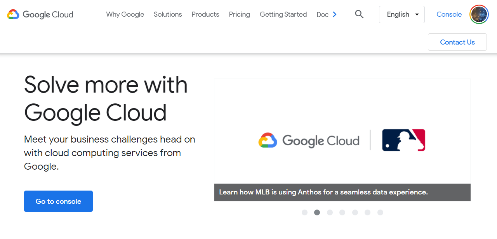

# Google Cloud Official Sites

## Google Cloud

### 커뮤니티

[ttps://www.cloudconnectcommunity.com/ccc/](https://www.cloudconnectcommunity.com/ccc/)

### 

### 클라우드 온에어

[https://cloudonair.withgoogle.com/](https://cloudonair.withgoogle.com/)

### 

### 클라우드 온보드

[https://cloudonair.withgoogle.com/onboard](https://cloudonair.withgoogle.com/onboard)

### 

### 이벤트

[https://cloud.google.com/events](https://cloud.google.com/events)

### 

### 자격증

#### 자격증 홈페이지

[https://cloud.google.com/certification/](https://cloud.google.com/certification/)

#### 자격증 접수 홈페이지

[https://webassessor.com/googlecloud](https://webassessor.com/googlecloud)

#### 자격증 Help center

[https://support.google.com/cloud-certification/gethelp](https://support.google.com/cloud-certification/gethelp)

#### 

### 학습

#### 교육 할인\(Start your learning journey with Google Cloud today\)

[https://inthecloud.withgoogle.com/training-discount/register.html](https://inthecloud.withgoogle.com/training-discount/register.html)

#### 실습\(Qwiklabs\)

[https://www.qwiklabs.com/?locale=ko](https://www.qwiklabs.com/?locale=ko)

### 

## Google Cloud Platform

### 공식 홈페이지

[https://cloud.google.com/](https://cloud.google.com/)

### 

### 콘솔

[https://console.cloud.google.com/](https://console.cloud.google.com/)

### 

### 공식 아이콘

[https://cloud.google.com/icons?hl=ko](https://cloud.google.com/icons?hl=ko)

### 

### 

### 블로그

#### 공식 블로그

[https://cloud.google.com/blog/products/gcp](https://cloud.google.com/blog/products/gcp)

#### 한국어 블로그

[https://cloud.google.com/blog/ko](https://cloud.google.com/blog/ko)

### 

### 문서

[https://cloud.google.com/docs](https://cloud.google.com/docs)

### 

### 상태 대시보드

[https://status.cloud.google.com/](https://status.cloud.google.com/)

## Google Workspace

### 공식 홈페이지

[https://workspace.google.com/intl/ko/](https://workspace.google.com/intl/ko/)

### 

### 관리 콘솔

[https://admin.google.com/](https://admin.google.com/)

### 

### 블로그

#### 공식 블로그

[https://cloud.google.com/blog/products/workspace](https://cloud.google.com/blog/products/workspace)

#### 업데이트 블로그

[https://workspaceupdates.googleblog.com/](https://workspaceupdates.googleblog.com/)

### 

### 관리자 고객센터

[https://support.google.com/a\#topic=4388346](https://support.google.com/a#topic=4388346)

### 

### 제품 업데이트

[https://support.google.com/a/table/7314896](https://support.google.com/a/table/7314896)

### 

### 제품 출시 캘린더

[https://workspace.google.com/whatsnew/calendar/](https://workspace.google.com/whatsnew/calendar/)

#### 제품 출시 캘린더 추가하는 방법

[https://support.google.com/a/answer/6390198](https://support.google.com/a/answer/6390198)

#### 제품 출시 캘린더 요약\(월별 뉴스레터\)

[https://workspace.google.com/whatsnew/](https://workspace.google.com/whatsnew/)

### 

### 상태 대시보드

[https://www.google.com/appsstatus\#hl=ko](https://www.google.com/appsstatus#hl=ko)

